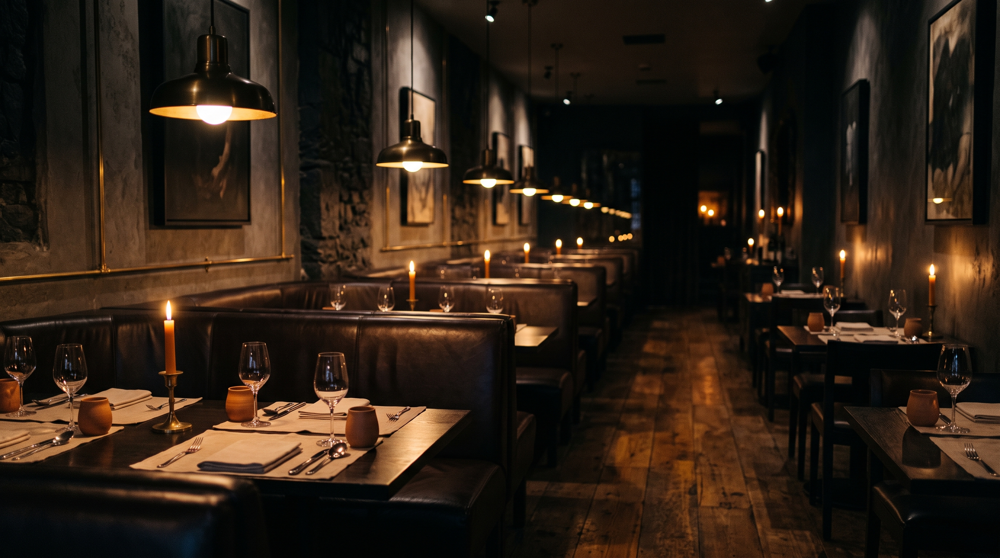
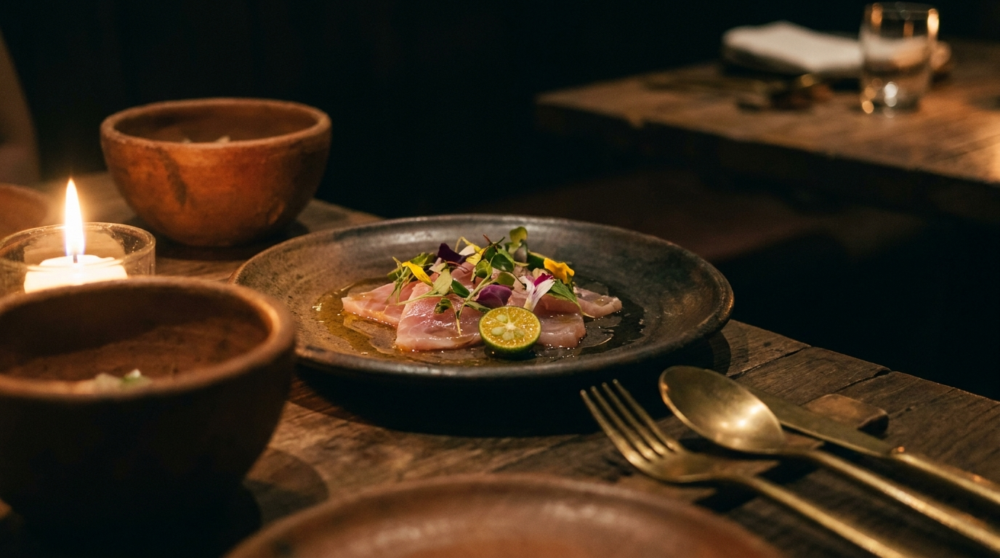
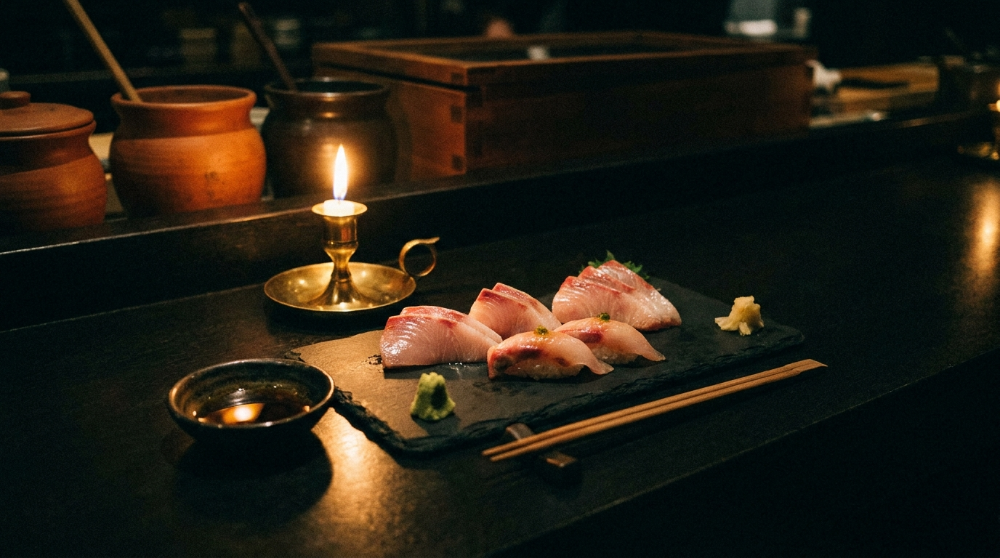
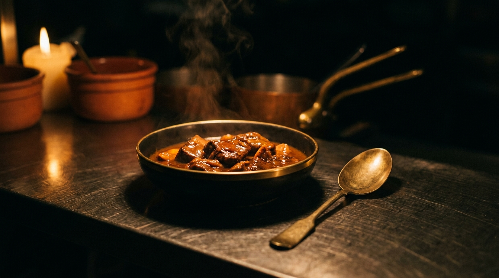

# Kayumanggi

**A premium restaurant website with a working booking engine.**
Live → **[kayumaggi-restaurant-website.vercel.app](https://kayumaggi-restaurant-website.vercel.app)**

A fine-dining site for a fictional Bonifacio Global City restaurant, built as a portfolio piece. The concept is a *culinary voyage*: one Filipino palate across four kitchens — Manila, Tokyo, Paris, Roma — rendered as a scroll itinerary you travel down.

The reservation form is not a contact form. It reads the restaurant's own book, decides whether the party fits the seating, records the decision, and emails the guest the verdict — confirming, or declining with the other times still open that evening.



---

## Contents

- [Tech stack](#tech-stack)
- [Platforms & APIs](#platforms--apis)
- [How the booking engine works](#how-the-booking-engine-works)
- [Design system](#design-system)
- [Motion](#motion)
- [How the assets were made](#how-the-assets-were-made)
- [How it was built, zero → deployed](#how-it-was-built-zero--deployed)
- [Running it locally](#running-it-locally)
- [Deploying](#deploying)
- [**Gotchas — read before changing anything**](#gotchas--read-before-changing-anything)
- [Project structure](#project-structure)

---

## Tech stack

| | |
|---|---|
| **Framework** | Next.js `16.2.10` (App Router, Server Actions, Turbopack) |
| **UI** | React `19.2.4` — uses React 19's `inert` prop |
| **Styling** | Tailwind CSS v4 (CSS-first config, `@theme inline`) |
| **Animation** | GSAP `3.15` + ScrollTrigger — *one* animation engine, deliberately |
| **Language** | TypeScript `5` |
| **Fonts** | Cormorant Garamond (display) + Karla (body), via `next/font` |
| **Hosting** | Vercel |

There is **no UI component library, no animation library besides GSAP, and no SDK for either API.** Airtable and Brevo are both called with plain `fetch`. That's a deliberate constraint — the whole app has four runtime dependencies.

> **Note:** framer-motion was installed early and then **removed**. The two 21st.dev components were ported onto GSAP so the site ships a single animation engine rather than two. If you're tempted to `npm i framer-motion`, that's why it isn't here.

---

## Platforms & APIs

### Airtable — the reservation book
The record of what has been promised, and therefore the thing availability is decided against.

- Base: table named `Reservations`
- Called via REST (`api.airtable.com/v0/…`), no SDK — `src/lib/airtable.ts`
- **Why not just email the booking?** An email is a *pipe*, not a *record*. You cannot ask an inbox "is 7:30 full?" The moment a booking became a row, availability became answerable — and that single change is what turned a form into a system.

### Brevo — guest email
Sends the confirm/decline email to the guest.

- Called via REST (`api.brevo.com/v3/smtp/email`), no SDK — `src/lib/email.ts`
- **Why Brevo and not Resend/Mailgun/SES?** This brand owns **no domain**. Every one of those requires a verified *domain* to email arbitrary people — without one they only deliver to your own address. Brevo lets you verify a single **sender address** instead, so real guests can be emailed from an address you already own.
- The provider is confined to one function (`send()`). Swapping to SendGrid means rewriting that function and nothing else.

### Vercel — hosting
`metadataBase` resolves from `VERCEL_PROJECT_PRODUCTION_URL` at build time, so Open Graph previews work on deploy with no hardcoded URL.

---

## How the booking engine works

```
submit
  │
  ├─ 1. validate ............ server-side, authoritative. Never trust the client.
  ├─ 2. read the book ....... how many covers are already Confirmed that evening?
  ├─ 3. decide .............. does this party fit the seating?
  ├─ 4. capture ............. write the row to Airtable WITH its verdict
  └─ 5. email ............... tell the guest, branded
```

Three rules are baked in, and each exists for a reason worth preserving:

**Capture is authoritative; email is best-effort.** If Brevo has a bad minute, the booking still stands and the guest still sees their answer on screen. *A table must never be lost because a mail provider hiccuped.*

**A failed availability *read* means "seats available", not "full".** If Airtable is unreachable, the booking goes through. Over-booking by one is recoverable; turning away a real guest because of *our* outage is not.

**Only `Confirmed` bookings consume seats.** Counting declined ones would shrink the room for everyone who came after.

A decline returns the other slots still open that evening — computed from the book already fetched, with no second round-trip. The on-screen panel shows them too, so the guest doesn't wait on an email to learn they should pick another time.

There's also a **honeypot** (`src/components/ReserveForm.tsx`): an off-screen field, unreachable by keyboard or screen reader. Anything that fills it gets a success-shaped response and is silently dropped. Once submissions *persist*, bot spam stops being noise and starts poisoning the data.

---

## Design system

"Dark Hearth" — a candlelit room. Tokens live in `src/app/globals.css`.

| Token | | Use |
|---|---|---|
| `--espresso` | `#14100c` | base background |
| `--charcoal` | `#211a13` | raised surfaces |
| `--bone` | `#efe7d8` | primary text |
| `--bone-dim` | `#c9bca6` | secondary text |
| `--bone-faint` | `#978b7c` | muted labels |
| `--brass` | `#c79a54` | the only accent that ever shouts |
| `--clay` | `#b5643c` | **borders/fills only** |
| `--clay-text` | `#cf8058` | terracotta *for text* |

**Every text colour clears WCAG AA.** Note the `--clay` / `--clay-text` split: the original terracotta measured **3.97:1** and failed AA as text, but passes the 3:1 bar for non-text UI. So it kept the borders and a lighter variant took the text. Don't collapse them back into one.

The wordmark is a custom SVG (`src/components/Wordmark.tsx`) — no icon mark, all-caps, wide tracking. Its `lockup` variant (footer only) adds gold-gradient letterforms and a hairline rule broken by a diamond. **The gold is footer-only on purpose**: restraint is the whole design argument, and gold everywhere turns a moment into a texture.

---

## Motion

All motion is GSAP + ScrollTrigger, centralised in `src/components/useHearthMotion.ts`.

**Everything is gated behind `gsap.matchMedia` + a pre-paint `.anim-ready` class** (set in `layout.tsx` before React hydrates). Reduced-motion and no-JS visitors get a fully visible, static, *finished* page — not a broken one. Initial hidden states live in CSS under `.anim-ready`, so there's no first-paint flash.

### Components from [21st.dev](https://21st.dev)

Two components originated at **21st.dev** and were vendored into `src/components/ui/`, then rewritten:

**`smooth-scroll-hero.tsx`** — the hero video revealed through a clip-path window that expands to fullscreen while the media zooms out, all scrubbed to scroll. *Changed:* ported from framer-motion to GSAP; scroll distance made viewport-relative on mobile (a fixed px value was ~2.4 screens of thumb-scrolling on a phone).

**`image-auto-slider.tsx`** — the infinite auto-scrolling gallery marquee. *Changed:* ported to CSS/GSAP, and **rebuilt to use margins instead of `gap`** — with `gap`, half the track width is off by half a gap, so the `translateX(-50%)` loop visibly stutters every cycle. Pauses on hover; becomes hand-scrollable under reduced-motion.

### The route rail

The menu's left rail *travels*. A dotted track shows the route not yet taken; a brass line draws down it; a glowing head rides the tip; each city's node sits unlit until the line reaches it, then ignites.

Two things there are load-bearing:

- **Nodes are driven off the line's own fill value, not a ScrollTrigger each.** A per-node trigger fires when the *node* crosses a viewport threshold — which is *not* the moment the *tip* arrives at it. They'd drift apart further down the rail. One timeline, one source of truth.
- **The route only ever advances.** `scrub` cannot express that: it maps scroll position onto timeline position *by definition*, so scrolling up necessarily rewinds it. The line is instead driven by a monotonic high-water mark rendered through `gsap.quickTo` — which keeps the eased lag `scrub` gave, without taking its direction from the scroll.

---

## How the assets were made

Everything visual in `public/` is generated. Nothing is stock.

| Asset | Tool |
|---|---|
| All 8 photographs (`gallery-*.jpg`, `story-room-v2.jpg`) | **[Google Labs](https://labs.google) — nano banana** (Gemini image generation) |
| Hero video (`hero-boeuf.mp4`) | **[Google Labs](https://labs.google) — Omni Flash** model |
| `hero-poster.jpg` | first frame of the hero video |
| Wordmark, favicon (`icon.svg`) | hand-authored SVG |
| OG image (`opengraph-image.tsx`) | generated at build by `next/og` |

The photographs were produced from written art-direction prompts — candlelit, brass, dark ceramic, shallow depth of field — so the imagery matches the design system rather than being retrofitted to it. That's the difference between "curated stock" and "looks commissioned."

<table>
<tr>
<td></td>
<td></td>
</tr>
<tr>
<td></td>
<td></td>
</tr>
</table>

**Hero video** → [`public/hero-boeuf.mp4`](public/hero-boeuf.mp4)
*(GitHub won't play a relative `.mp4` inline. To embed a player, drag the file into any GitHub issue comment, then paste the resulting `user-attachments` URL here.)*

---

## How it was built, zero → deployed

1. **Intake** — identity, style direction, pages, content, stack, animation appetite. Decided *before* any code.
2. **Design tokens first** — the palette and type scale landed before a single component, so nothing had to be retrofitted to a colour system invented later.
3. **Concept pivot** — the original menu was Filipino *fusion*. It became four **authentic** kitchens instead: each city's own cuisine, cooked faithfully. Fusion was the obvious idea and the worse one.
4. **Components + motion** — hero, story, menu itinerary, gallery, reservation. 21st.dev components vendored and rewritten onto GSAP; framer-motion removed.
5. **Real imagery** — the abstract CSS "plate" placeholders were deleted once the generated photography landed.
6. **Accessibility & performance pass** — audited against an 8-point "premium site" checklist. Fixed: WCAG AA contrast failures, a mobile nav that collapsed once scrolled, offscreen links still in the tab order, a below-fold image preloading 3 MB against the hero video.
7. **The booking engine** — Airtable capture → availability decision → Brevo confirm/decline. Verified end to end with real bookings.
8. **Deploy** — Vercel, with env vars set.

---

## Running it locally

```bash
npm install
cp .env.example .env     # then fill it in — see below
npm run dev
```

The site runs fine with an **empty `.env`**. The form validates server-side, logs the request, and returns success — it just captures nothing and emails no one. Nothing breaks.

### Environment

| Var | Required for | Notes |
|---|---|---|
| `AIRTABLE_TOKEN` | capture | Personal Access Token, scoped `data.records:write` **on that one base** |
| `AIRTABLE_BASE_ID` | capture | the `app…` segment of the base URL |
| `AIRTABLE_TABLE` | capture | defaults to `Reservations` |
| `BREVO_API_KEY` | email | from the **API Keys** tab — starts `xkeysib-` |
| `RESERVATIONS_FROM_EMAIL` | email | must be a **verified sender** in Brevo |
| `RESERVATIONS_FROM_NAME` | email | the display name inboxes actually show |
| `RESERVATION_CAPACITY` | decisions | covers per seating. Default `40` |

The Airtable table needs these columns, **spelled exactly**: `Name`, `Email`, `Phone`, `Date`, `Time`, `Guests`, `Occasion`, `Notes`, `Status` (single-select: `Confirmed`, `Declined`), `Submitted` (date **with time**).

### Verify the integrations

```bash
npm run check:airtable   # writes a test row, deletes it, names any column mismatch
npm run check:email      # sends a test message, names an unverified sender
```

Both scripts exist because the raw API errors are useless. Airtable answers a column-name mismatch with a terse 422; Brevo answers a wrong-key-type with "Key not found." These name the *actual* problem.

### Demo a decline

Set `RESERVATION_CAPACITY=4`, restart, and book a party of 5. You'll get the decline email with alternative times, and the matching on-screen panel. Set it back to `40` afterwards.

---

## Deploying

Vercel, standard Next.js. **Set the env vars in Vercel** — `.env` is gitignored and does **not** travel with the repo.

> ⚠️ **The failure mode here is silent.** With env vars missing, the deployed form still validates, still says "confirmed", and captures **nothing**. It looks identical to working. That graceful degradation is deliberate — a visitor should never see a stack trace — which is precisely what makes it easy to miss. **Submit one real booking against production and check Airtable for the row.**

---

## Gotchas — read before changing anything

Every one of these cost real debugging time. They are not obvious from the code.

**`backdrop-filter` creates a containing block for `position: fixed` descendants.**
The mobile nav sheet is deliberately a **sibling** of `<header>`, not a child. The header gets `backdrop-blur` once scrolled — nest a `fixed inset-0` sheet inside it and `inset-0` resolves against the *74px header box* instead of the viewport, collapsing the menu into a strip under the navbar. Since nobody opens a nav menu without scrolling first, the broken state is the *normal* state. **Don't move the sheet back inside the header.**

**`pointer-events-none` does nothing to tab order.**
The closed nav sheet uses `inert`. An offscreen `translate-x-full` element with `pointer-events-none` is *still focusable* — keyboard users tab into invisible links. And `aria-hidden` on a container with focusable children is itself an accessibility violation. `inert` handles both.

**`scrub` cannot latch.** See [the route rail](#the-route-rail). If you "simplify" it back to a scrubbed tween, the voyage will un-travel itself when the user scrolls up.

**Variable fonts share one file per unicode subset.** Cormorant and Karla are variable fonts — `next/font` emits one woff2 *per subset*, not per weight. Adding or removing weights from the `weight: []` array changes the number of `@font-face` declarations, **not** the number of bytes downloaded. Don't "optimise" weights expecting a payload win; there isn't one. (Actual font cost: ~61 KB, two files.)

**Brevo has two keys and they sit on adjacent tabs.** The **SMTP** tab gives `xsmtpsib-…` (for SMTP relay). The **API Keys** tab gives `xkeysib-…` (for the REST API). This code needs the REST one. Use the wrong one and Brevo says "Key not found", which does not hint at the real problem. `check:email` detects it by prefix.

**Guest email may land in Spam, and that's not a bug.** Mail sent from a `gmail.com` sender through Brevo's servers can't pass DMARC alignment — Gmail doesn't authorise Brevo to send on its behalf. Unavoidable without owning a domain. Buying one is the only real fix.

**Airtable 422s on any column-name mismatch.** Names are case-sensitive and exact. `Guests`, not `guests` or `Party Size`. Run `check:airtable` after touching the schema.

**`process.exit()` inside async code is a footgun.** Calling it while `fetch` still holds an open socket trips a libuv assertion on Windows. Both check scripts set `process.exitCode` and let the process wind down instead.

---

## Project structure

```
src/
├── app/
│   ├── page.tsx              the whole site — hero, story, menu, gallery, reserve
│   ├── layout.tsx            fonts, metadata, the pre-paint motion gate
│   ├── globals.css           design tokens + all non-GSAP motion
│   ├── actions.ts            Server Action: validate → decide → capture → email
│   └── opengraph-image.tsx   OG card, generated at build
├── components/
│   ├── Nav.tsx               sticky nav + the inert mobile sheet
│   ├── ReserveForm.tsx       the form, its verdicts, the honeypot
│   ├── Wordmark.tsx          SVG wordmark + the gold footer lockup
│   ├── Destination.tsx       one stop on the route rail
│   ├── useHearthMotion.ts    ALL GSAP lives here
│   └── ui/                   ← vendored from 21st.dev, rewritten onto GSAP
├── lib/
│   ├── airtable.ts           capture + availability read
│   ├── email.ts              Brevo + the HTML templates
│   └── reservations.ts       shared vocabulary (times, party sizes, capacity)
scripts/
├── check-airtable.mjs        npm run check:airtable
└── check-email.mjs           npm run check:email
public/                       all generated imagery + the hero video
```

**HTML email is not web HTML** (`src/lib/email.ts`): no flexbox, no grid, no web fonts, and `<style>` blocks get stripped by several clients — hence tables and inlined styles throughout. Cormorant won't load and falls back to Georgia, which happens to suit the brand.

---

<sub>Built with Next.js. Imagery generated with Google Labs (nano banana / Omni Flash). Hero and gallery components originated at [21st.dev](https://21st.dev) and were rewritten onto GSAP.</sub>
